<a name="HOLTitle"></a>
# Running Docker Containers in the Azure Container Service #

---

<a name="Overview"></a>
## Overview ##

Containers, which allow software and files to be bundled up into neat packages that can be run on different computers and different operating systems, are earning a lot of attention these days. And almost synonymous with the term "container" is the term "Docker." [Docker](http://www.docker.com) is the world's most popular containerization platform. This description of it comes from the Docker Web site:

*Docker containers wrap a piece of software in a complete filesystem that contains everything needed to run: code, runtime, system tools, system libraries – anything that can be installed on a server. This guarantees that the software will always run the same, regardless of its environment.*

Containers are similar to virtual machines (VMs) in that they provide a predictable and isolated environment in which software can run. Because containers are smaller than VMs, they start almost instantly and use less RAM. Moreover, multiple containers running on a single machine share the same operating system kernel. Docker is based on open standards, enabling Docker containers to run on all major Linux distributions as well as Windows Server 2016.

To simplify the use of Docker containers, Azure offers the [Azure Container Service](https://azure.microsoft.com/en-us/services/container-service/) (ACS), which hosts Docker containers in the cloud and provides an optimized configuration of popular open-source scheduling and orchestration tools, including [DC/OS](https://dcos.io/) and [Docker Swarm](https://www.docker.com/products/docker-swarm). The latter uses native clustering capabilities to turn a group of Docker engines into a single virtual Docker engine using the configuration shown below and is a handy tool for executing CPU-intensive jobs in parallel. In essence, one or more master VMs control a "swarm" of agent VMs created from an [Azure Virtual Machine Scale Set](https://azure.microsoft.com/en-us/documentation/articles/virtual-machine-scale-sets-overview/). The agent VMs host Docker containers that execute your code.


 _Docker Swarm configuration in the Azure Container Service_
 
In this lab, you will package a Python app and a set of color images in a Docker container. Then you will run the container in Azure and run the Python app inside it to convert the color images to grayscale. You will get hands-on experience using the Azure Container Service and tunneling in to execute Docker commands and manipulate Docker containers.

<a name="Objectives"></a>
### Objectives ###

In this hands-on lab, you will learn how to:

- Create an Azure Container Service
- Tunnel in to an Azure Container Service using SSH
- Create Docker images and run Docker containers in Azure
- Run jobs in containers created from Docker images
- Delete a container service

<a name="Prerequisites"></a>
### Prerequisites ###

The following are required to complete this hands-on lab:

- An active Microsoft Azure subscription. If you don't have one, [sign up for a free trial](http://aka.ms/WATK-FreeTrial).
- [PuTTY](http://www.chiark.greenend.org.uk/~sgtatham/putty/download.html) (Windows users only)
- Docker client (also known as the *Docker Engine CLI*) for [Windows](https://download.docker.com/win/stable/InstallDocker.msi), [macOS](https://download.docker.com/mac/stable/Docker.dmg), or [Linux](https://get.docker.com/builds/Linux/x86_64/docker-latest.tgz)

You do not need to install the Docker client if you already have Docker (or Docker Toolbox) installed on your machine.

You may need to install [Docker Toolbox](https://docs.docker.com/toolbox/overview/) if you have an older Mac or Windows system. 

---
<a name="Exercises"></a>
## Exercises ##

This hands-on lab includes the following exercises:

- [Exercise 1: Create an SSH key pair](#Exercise1)
- [Exercise 2: Create an Azure Container Service](#Exercise2)
- [Exercise 3: Connect to the Azure Container Service](#Exercise3)
- [Exercise 4: Create a Docker image and run it in a container](#Exercise4)
- [Exercise 5: Suspend the master VM](#Exercise5)
- [Exercise 6: Delete the resource group](#Exercise6)

Estimated time to complete this lab: **60** minutes.

<a name="Exercise1"></a>
## Exercise 1: Create an SSH key pair

Before you can deploy Docker images to Azure, you must create an Azure Container Service. And in order to create an Azure Container Service, you need a public/private key pair for authenticating with that service over SSH. In this exercise, you will create an SSH key pair. If you are using macOS or Linux, you will create the key pair with ssh-keygen. If you are running Windows instead, you will use a third-party tool named PuTTYGen.

> Unlike macOS and Linux, Windows doesn't have an SSH key generator built in. PuTTYGen is a free key generator that is popular in the Windows community. It is part of an open-source toolset called [PuTTY](http://www.putty.org/), which provides the SSH support that Windows lacks.

### Mac and Linux Users ###
**If you are running Windows, skip to the Windows Users section**.
1. On your Mac or Linux machine, launch a terminal window.

1. Execute the following command in the terminal window:

	<pre>ssh-keygen</pre>

	Press **Enter** three times to accept the default output file name and create a key pair without a passphrase. The output will look something like this: 

 	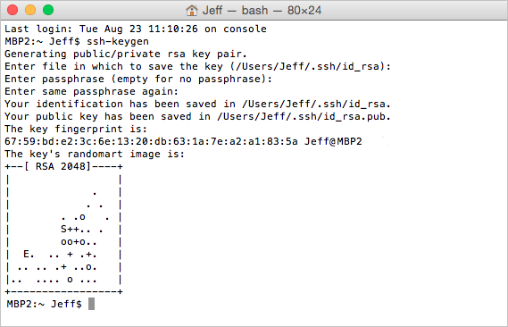

	_Generating a public/private key pair_

1. Use the following commands to navigate to the hidden ".ssh" subdirectory created by ssh-keygen and list the contents of that subdirectory:

	```	
	cd ~/.ssh
	ls
	```

	Confirm that the ".ssh" subdirectory contains a pair of files named **id_rsa** and **id_rsa.pub**. The former contains the private key, and the latter contains the public key.

1. Leave the terminal window open and **proceed to [Exercise 2](#Exercise2)**.

### Windows Users ###

1. Launch PuTTYGen and click the **Generate** button. For the next few seconds, move your cursor around in the empty space in the "Key" box to help randomize the keys that are generated.

 	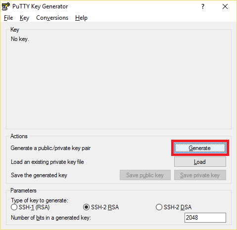

	_Generating a public/private key pair_

1. Once the keys are generated, click **Save public key** and save the public key to a text file named **public.txt**. Then click **Save private key** and save the private key to a file named **private.ppk**. When prompted to confirm that you want to save the private key without a passphrase, click **Yes**.

 	

	_Saving the public and private keys_

You now have a pair of files containing a public key and a private key. Remember where these files are located, because you will need them in subsequent exercises.

<a name="Exercise2"></a>
## Exercise 2: Create an Azure Container Service

Now that you have an SSH key pair, you can create and configure an Azure Container Service. In this exercise, you will use the Azure Portal to create an Azure Container Service for running Docker containers.

1. Open the [Azure Portal](https://portal.azure.com) in your browser. If you are asked to log in, do so using your Microsoft account.

1. Click **+ New**, followed by **Containers** and **Azure Container Service**.

	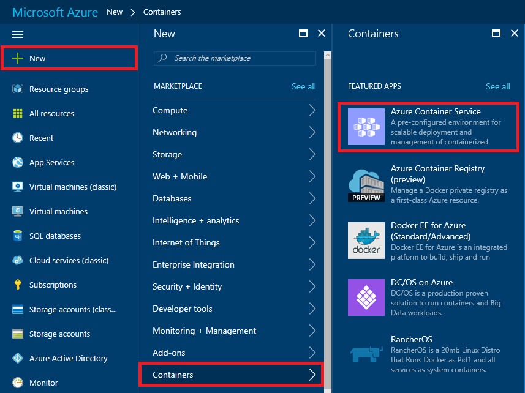

	_Creating a container service_

1. Click the **Create** button at the bottom of the "Azure Container Service" blade. In the "Basics" blade, select **Swarm** as the orchestrator. Select **Create new** under **Resource group** and enter the resource-group name "ACSLabResourceGroup" (without quotation marks). Select the location nearest you under **Location**, and then click the **OK** button.

	> Swarm, DC/OS, and Kubernetes are popular open-source orchestration tools that enable you to deploy clusters containing thousands or even tens of thousands of containers. (Think of a compute cluster consisting of containers rather than physical servers, all sharing a load and running code in parallel.)  All three are preinstalled in Azure Container Service, with the goal being that you can use the one you are most familiar with rather than learn a new tool. Swarm is Docker's own native clustering tool.

	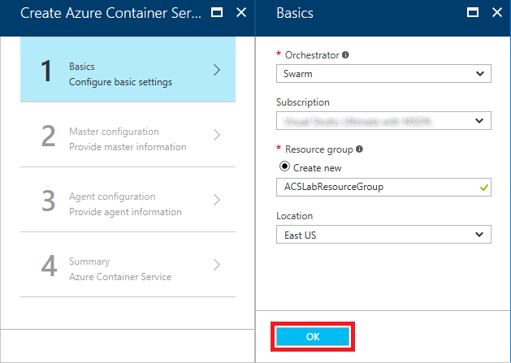

	_Basic settings_

1. In the "Master configuration" blade, enter a DNS name prefix in the **DNS name prefix** box. (The prefix doesn't have to be unique across Azure, but it does have to be unique to a data center. To ensure uniqueness, you should *include birth dates or other personal information* that is unlikely to be used by other people working these exercises. Otherwise, you may see a green check mark in the **DNS name prefix** box but still suffer a deployment failure.) Enter "dockeruser" (without quotation marks) for **User name** and the public key that you generated in [Exercise 1](#Exercise1) for **SSH public key**. Then set **Master count** to **1** and click **OK**.

	> You can retrieve the public key from the **id_rsa.pub** or **public.txt** file that you generated in Exercise 1 and paste it into **SSH public key** box.

	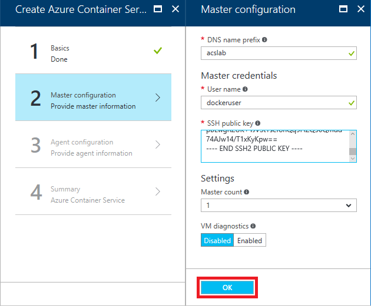

	_Master configuration settings_

1. In the "Agent configuration" blade, set **Agent count** to **2**. Then click **OK**.

	> When you create an Azure Container Service, one or more master VMs are created to orchestrate the workload. In addition, an [Azure Virtual Machine Scale Set](https://azure.microsoft.com/en-us/documentation/articles/virtual-machine-scale-sets-overview/) is created to provide VMs for the "agents," or VMs that the master VMs delegate work to. Docker container instances are hosted in the agent VMs. By default, Azure uses a standard DS2 virtual machine for each agent. These are dual-core machines with 7 GB of RAM. Agent VMs are created as needed to handle the workload. In this example, there will be one master VM and up to two agent VMs.

	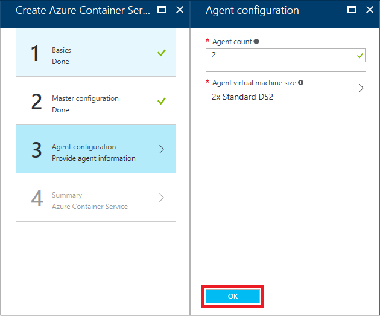

	_Agent configuration settings_

1. In the "Summary" blade, review the settings you selected. Then click **OK**.

	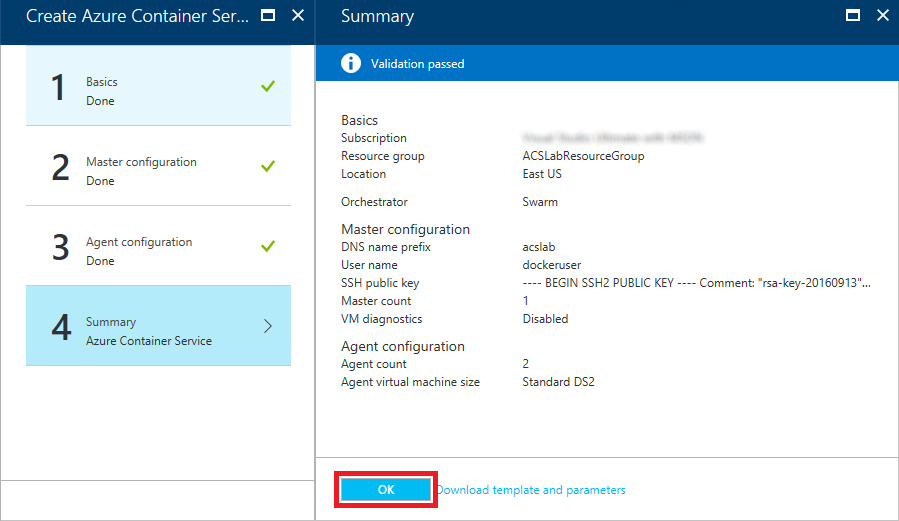

	_Settings summary_

1. Deployment typically takes 5 to 10 minutes. You can monitor the status of the deployment by opening the blade for the resource group created for the container service. Click **Resource groups** in the ribbon on the left. Then click the resource group named "ACSLabResourceGroup."

    

	_Opening the resource group_

1. Wait until "Deploying" changes to "Succeeded," indicating that the service has been successfully deployed.

	> Click the browser's **Refresh** button occasionally to update the deployment status. Clicking the **Refresh** button in the resource-group blade refreshes the list of resources in the resource group, but does not reliably update the deployment status.

    

	_Successful deployment_

When the deployment completes successfully, you will see all the resources that comprise the container service in the resource group. The next step is to open a secure connection to the service.

<a name="Exercise3"></a>
## Exercise 3: Connect to the Azure Container Service ##

In this exercise, you will retrieve fully qualified domain names (FQDNs) for the master node and agent node of the container service you deployed in the previous exercise. You will use that FQDN to connect to ACS.

1. In the blade for the "OrchestrationLabResourceGroup" resource group, click the container service.

    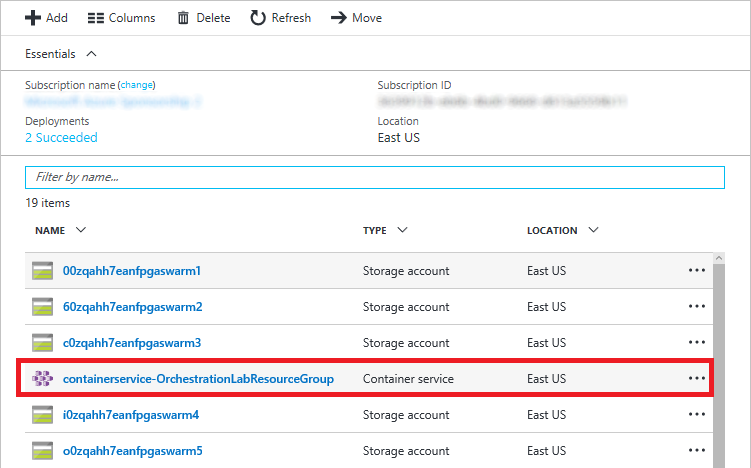

	_Opening the container service_

1. Hover the mouse pointer over the master fully qualified domain name. When a **Copy** button appears, click it to copy the domain name to the clipboard. Then **paste the name into your favorite text editor so you can retrieve it later**. This is the **master FQDN**.

    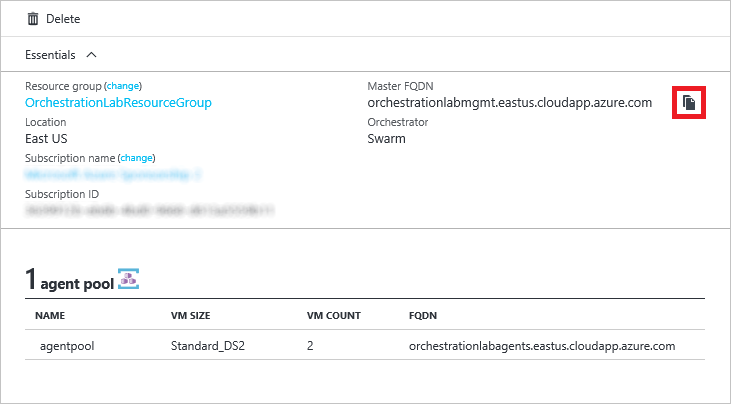

	_Copying the master FQDN to the clipboard_

1. Copy the fully qualified domain name of the agent node to the clipboard and save it in your favorite text editor so you can retrieve it later. This is the **agent FQDN**.

    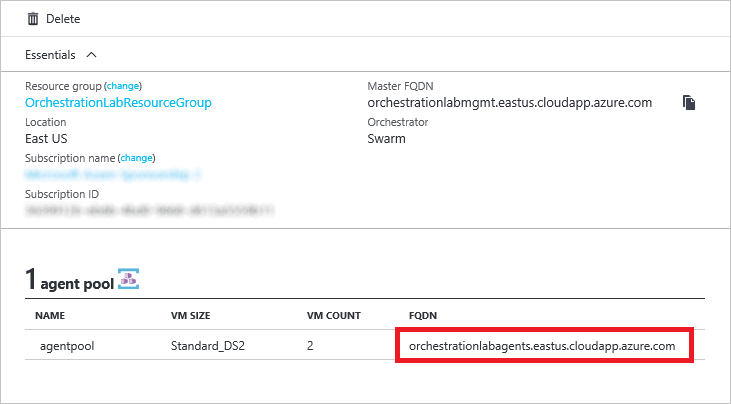

	_Copying the agent FQDN to the clipboard_

### Mac and Linux Users ###
**If you are running Windows, skip to the Windows Users section**. 

1. On your Mac or Linux machine, return to the terminal window you opened in Exercise 1 and make sure you are still in the ".ssh" directory containing the key pair that you generated.

1. Execute the following command to SSH in to the Azure Container Service, replacing *ipaddress* with the IP address on the clipboard (and deleting the DNS name after the IP address):

	<pre>ssh -fNL 2375:localhost:2375 -p 2200 dockeruser@<i>FQDN</i> 

	> The purpose of the -L switch is to forward traffic transmitted through port 22375 on the local machine (that's the port used by the **docker** command you will be using shortly) to port 2375 at the other end. Docker Swarm listens on port 2375. The -p switch instructs SSH to use port 2200 rather than the default 22. The load balancer you're connecting to listens on port 2200 and forwards the SSH messages it receives to port 22 on the master VM.

1. If asked to confirm that you wish to connect, answer yes. Once connected, you'll see a screen that resembles the one below.

	> Observe that you didn't have to enter a password. That's because the connection was authenticated using the public/private key pair you generated in Exercise 1. Key pairs tend to be much more secure than passwords because they are cryptographically strong.

	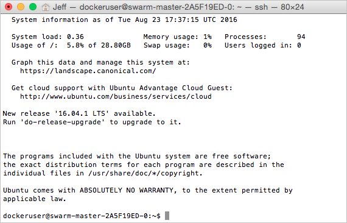

	_Successful connection_

1. Leave the terminal window open and **proceed to [Exercise 4](#Exercise4).**. 

### Windows Users ###

1. Launch PuTTY and paste the IP address on the clipboard into the **Host Name (or IP address)** box. (Be sure to delete the DNS name after the IP address). Set the port number to **2200** and type "ACS" (without quotation marks) into the **Saved Sessions** box. Click the **Save** button to save these settings under that name.

	> Why port 2200 instead of port 22, which is the default for SSH? Because the load balancer you're connecting to listens on port 2200 and forwards the SSH messages it receives to port 22 on the master VM.

	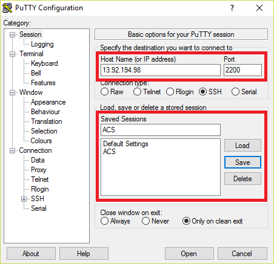

	_Configuring a PuTTY session_

1. In the treeview on the left, click the + sign next to **SSH**, and then click **Auth**. Click the  **Browse** button and select the private-key file that you created in Exercise 1.

	

	_Entering the private key_

1. Select **Tunnels** in the treeview. Then set **Source port** to **2375** and **Destination** to **127.0.0.1:2375**, and click the **Add** button.

	> The purpose of this is to forward traffic transmitted through port 22375 on the local machine (that's the port used by the **docker** command you will be using shortly) to port 2375 at the other end. Docker Swarm listens on port 2375.
	
	

	_Configuring the SSH tunnel_

1. Click **Session** at the top of the treeview. Click the **Save** button to save your configuration changes, and then click **Open** to create a secure SSH connection to the container service. If you are warned that the server's host key isn't cached in the registry and asked to confirm that you want to connect anyway, click **Yes**.

	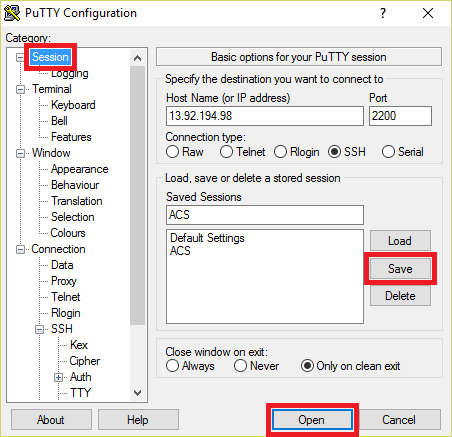

	_Opening a connection to the container service_

1. An SSH window will open and prompt you to log in. Enter the user name ("dockeruser") that you specified in Exercise 2, Step 4. Then press the **Enter** key. Once connected, you'll see a screen that resembles the one below.

	> Observe that you didn't have to enter a password. That's because the connection was authenticated using the public/private key pair you generated in Exercise 1. Key pairs tend to be much more secure than passwords because they are cryptographically strong.

	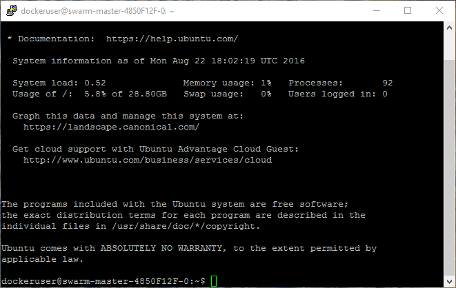

	_Successful connection_

Now that you're connected, you can run the Docker client on your local machine and use port forwarding to execute commands in the Azure Container Service. Leave the SSH window open while you work through the next exercise.

<a name="Exercise4"></a>
## Exercise 4: Deploy a Docker container to Azure Container Service 

To create a new container in the Docker Swarm, use the `docker run` command (ensuring that you have opened an SSH tunnel to the masters as per the prerequisites above). This example creates a container from the yeasy/simple-web image.

1. Open a terminal window (macOS or Linux) or a Command Prompt window (Windows).

1. If you are running macOS or Linux, execute the following command in the terminal window:

	<pre>export DOCKER_HOST=tcp://127.0.0.1:22375</pre>

	If you are running Windows instead, execute this command in the Command Prompt window:

	<pre>set DOCKER_HOST=tcp://127.0.0.1:22375</pre>

	> This command directs the Docker client to send output to localhost port 22375, which you redirected to port 2375 in the Azure Container Service in the previous exercise. Remember that port 2375 is the one Docker Swarm listens on. The commands that you execute in the next few steps are typed into a local terminal window, but they are **executed in the container service you deployed to the cloud** using the SSH tunnel that you established in the previous exercise.

1. Run the following command to pull the _yeasy/simple-web_ container:

	<pre>docker pull yeasy/simple-web</pre>

1. Wait for the command to finish executing. (It will take a few minutes for Docker to pull the container image.) Then execute the following command to list the images that are present, and confirm that the list contains an image named "yeasy/simple-web:"

	<pre>docker images</pre>

1. Now execute the following command to start the container image running and name the container "acslab:"

	<pre>docker run -d -p 80:80 yeasy/simple-web --name acslab</pre>

1. The container is now running. You can use the FQDN to pullup Simple Web


	
	

1. You can use `docker ps` to return information about the container. Notice the name of the Swarm agent running your container.

	<pre>docker ps</pre>

1. As multiple containers are started, by executing 'docker run' multiple times, you can use the docker ps command to see which hosts the containers are running on. 

	<pre>docker run -d -p 80:80 yeasy/simple-web --name acslab</pre>
	<pre>docker ps</pre>

1. See what happens if you try to provision containers in your Swarm.
	<pre>docker run -d -p 80:80 yeasy/simple-web --name acslab</pre>
	<pre>docker run -d -p 80:80 yeasy/simple-web --name acslab</pre>

1. Stop the running container by executing the following command:

	<pre>docker stop acslab</pre>

1. Type the following command to delete the "acslab" container:

	<pre>docker rm acslab</pre>

Congratulations! You just created a Docker container image and ran it in a Docker container hosted in Azure. You can close the SSH window now because you are finished using the SSH connection.

<a name="Exercise5"></a>
## Exercise 5: Suspend the master VM

When virtual machines are running, you are being charged — even if the VMs are idle. Therefore, it's advisable to stop virtual machines when they are not in use. You will still be charged for storage, but that cost is typically insignificant compared to the cost of an active VM.

Your container service contains a master VM that needs to be stopped when you're not running containers. The Azure Portal makes it easy to stop virtual machines. VMs that you stop are easily started again later so you can pick up right where you left off. In this exercise, you will stop the master VM to avoid incurring charges for it.

1. In the Azure Portal, open the blade for the "ACSLabResourceGroup" resource group. Click the virtual machine whose name begins with **swarm-master** to open a blade for the master VM.

	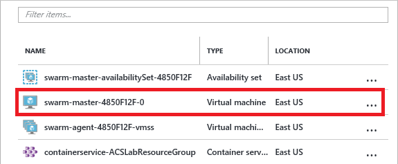
	
	 _Opening a blade for the master VM_

1. Click the **Stop** button to stop the master VM. Answer **Yes** when prompted to verify that you wish to stop it.

	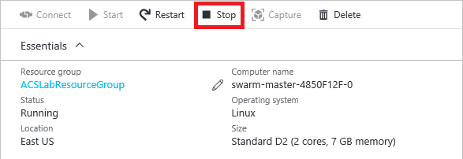
	
	_Stopping the master VM_

There is no need to stop the agent VMs. They are part of an [Azure Virtual Machine Scale Set](https://azure.microsoft.com/en-us/documentation/articles/virtual-machine-scale-sets-overview/) and are automatically spun up and down as needed by the master VM. Note that if you wish to run containers again in this container service, you will need to restart the master VM.

<a name="Exercise6"></a>
## Exercise 6: Delete the resource group

Resource groups are a useful feature of Azure because they simplify the task of managing related resources. One of the most practical reasons to use resource groups is that deleting a resource group deletes all the resources it contains. Rather than delete those resources one by one, you can delete them all at once.

> If you plan on doing **Session 2 - Docker Orchestration and the Azure Container Service**, you may want to skip this step instead of deleting and re-creating yourAzure Container Service.

In this exercise, you will delete the resource group created in [Exercise 2](#Exercise2) when you created the container service. Deleting the resource group deletes everything in it and prevents any further charges from being incurred for it.

1. In the Azure Portal, open the blade for the "ACSLabResourceGroup" resource group. Then click the **Delete** button at the top of the blade.

	

	_Deleting a resource group_

1. For safety, you are required to type in the resource group's name. (Once deleted, a resource group cannot be recovered.) Type the name of the resource group. Then click the **Delete** button to remove all traces of this lab from your account.

After a few minutes, you will be notified that the resource group was deleted. If the deleted resource group still appears in the "Resource groups" blade, click that blade's **Refresh** button to update the list of resource groups. The deleted resource group should go away.  

## Summary ##

The Azure Container Service makes it easy to run apps packaged in Docker containers in the cloud without having to manage servers or install a container stack yourself. Container images are smaller than VM images, they start faster, and they typically cost less since a single VM can host multiple container instances. More importantly, Docker containers can be hosted in other cloud platforms such as Amazon Web Services (AWS). If you want to avoid being tied to a single cloud platform, containers are a great way to achieve that independence.

---

Copyright 2016 Microsoft Corporation. All rights reserved. Except where otherwise noted, these materials are licensed under the terms of the MIT License. You may use them according to the license as is most appropriate for your project. The terms of this license can be found at https://opensource.org/licenses/MIT.