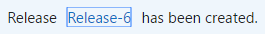
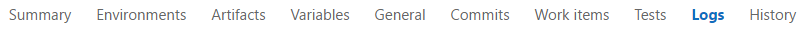

# DevOps In Azure
*Presented by Nick Martin*

To review the concepts, refer to the associated [presentation slides](Presentation.pptx).

This lab shows the following key concepts:
- Creating a Delivery Pipeline in Visual Studio Team Services (VSTS)
- Resource management with Azure Resource Manager (ARM) templates
- Configuration management with VSTS and ARM templates for multiple environments
- Application Lifecyle Management (ALM)

An important concept in the Ops part of DevOps is operational support. Azure provides a large number of mechanisms for logging, monitoring, and tracking telemetry, but these are out of scope for this lab.

**Lab Tasks**:
1. [Setting Up VSTS](#1-Setting-Up-VSTS)
1. [Setting Up the Delivery Pipelines](#2-Setting-Up-the-Delivery-Pipelines)
1. [Adding a New Environment](#3-Adding-a-New-Environment)
1. [Adding New Resources and Deployable](#4-Adding-New-Resources-and-Deployable)

## 0. Prerequisites

- **A Windows machine** - this is due to the Visual Studio requirement.
<br />*NOTE:* If not on Windows, a similar but simpler [Microsoft-provided lab](https://github.com/Microsoft/TechnicalCommunityContent/blob/master/DevOps/DevOps/Session%203%20-%20Practical%20DevOps/HOL%203.2%20-%20VotingApp%20Full%20Continuous%20Integration%20Deployment/HOL%203.2.md) can get you started, and you can review this lab content for more advanced concepts such as handling multiple environments with configuration management.
- **An internet connection** - during the bootcamp, instructions will be provided for you to get online.
- **An active Azure subscription** - if you haven't already, you can get a [free trial](https://azure.microsoft.com/en-us/free/), otherwise the bootcamp organizers may be able to provide you with free credits.
- **An active VSTS Account** - [create one if needed](https://www.visualstudio.com/en-us/docs/setup-admin/team-services/sign-up-for-visual-studio-team-services). Note the instructions below assume a Git repository, but this lab can be also be completed with a Team Foundation Version Control repository.
<br />*NOTE:* If possible, use the same login credentials you use for your Azure subscription for the VSTS account. This enables direct integrate of your Azure subscription in VSTS. Otherwise, additional steps are necessary to connect them.
- **Visual Studio 2017** - the free [Community Edition](https://www.visualstudio.com/downloads/) works fine.
<br />*NOTE:* You do NOT have to be a developer to complete this lab. All the application logic is written for you.
<br />*NOTE:* Earlier versions should work, but has not been tested and may require additional setup.
- **Git tools** - [download](https://git-scm.com/downloads) directly, or optionally installed with Visual Studio.
- **Microsoft SQL Server Express** (*Recommended*) - for running the application locally.

## 1. Setting Up VSTS

In order to keep things organized within your account, lets create a new Team Project.

### 1.a Creating the Team Project


1. Login to your VSTS account at {your-account-name}.visualstudio.com
1. Creat a new team project

1. Name your project **GAB2017** and, use **Git** for the version control repository, choose the **Scrum** process template (purely for preference), and click **Create**
1. In order to use the Git CLI, click **Generate Git credentials**

1. Enter credentials and **Save Git Credentials**

### 1.b Adding Work Items

At this point your Team Project is ready to use, but lets add some work items to demonstrate the ALM capabilities of VSTS and some ways that the Delivery Pipeline ties into them.
<br />*NOTE:* There is a LOT more to the ALM capabilities than what is shown in this lab.

1. Go to the **Work** section of your new Team Project via the top-level navigation bar

1. Add the following work items:
    1. **Create basic website**
    1. **Add Web Job background task**
    1. **Record feedback to database**
<br />

For the purpose of this lab, don't bother putting any details into these work items other than the title.

### 1.c Preparing the Source Control Repository

The project sources are currently in this GitHub repository. VSTS allows you to drive a Delivery Pipeline from a GitHub repository, but this would require you to fork the repository in order to have access to push updates to trigger the Continuous Integration (CI) process.

Instead, we will use the Git repository within the VSTS repository so will copy the sources over.
<br />*NOTE:* You can also push existing repositories into VSTS rather than the below method.

1. First, if you haven't already, [clone this GitHub repository](https://help.github.com/articles/cloning-a-repository/) to your machine
1. Go back in VSTS, and return to the **Code** section

1. Copy the HTTPS url to the Git repository

1. In your Git command prompt of choice and navigate to where you want to clone the VSTS repository
1. Clone the repository with command `git clone <paste-HTTPS-url-copied-earlier>`
<br />*NOTE:* Git will give you a warning that you've cloned an empty repository, we will ignore the warning.
1. Move into the cloned repository folder with command `cd GAB2017`
1. In Windows Explorer copy the entire contents within the GitHub repository's **DevOps/begin** folder into the VSTS repository **GAB2017** folder
1. Back in the command prompt, commit and push all sources using the following commands:
```
git add .
git commit -m "Adding sources"
git push origin master
```

Feel free to open the **Feedback.sln** file in Visual Studio and run the website. This is a very simple page that has a feedback form. Submitted feedback is stored in SQL and all saved history is listed back to the user. When running locally, the 

## 2. Setting Up the Delivery Pipeline

A [Delivery Pipeline](https://devops.com/continuous-delivery-pipeline/) is the core pattern that underpins Continuous Delivery. Creating and managing this pipeline is a common task of DevOps teams.

### 2.a Creating the Build Definition

A Delivery Pipeline always starts with a build being triggered by some change in the system. This is refered to as a Continuous Integration (CI) build.

Microsoft is currently rolling out a new build definition editor. The screenshots in these instructions are for the old build definition editor. If you opt in to the new UI the look & feel will vary but the steps should approximately match. You can control which editor is in use via the **Preview features** panel.
<br />

1. Go back in VSTS, and go to the **Build & Release** section

1. Click **New** to create a new build definition
<br />
1. In the list, select **Visual Studio** (should be selected by default) and click **Next**
1. In the next screen, validate the following settings:
   * Repository source should be **GAB2017 Team Project**
   * Repository should be **GAB2017**
   * Default branch should be **master**
   * The **Continuous integration (build whenever this branch is updated)** option should be checked *(not default)*
   * Default agent queue should be **Hosted VS2017** *(not default)*
   * Select folder should be **\\**
1. Click **Create**
<br />*NOTE:* This didn't actually create a build definion, but rather a template for a build definition. In the following steps you configure the build definition and save it.
1. Select the **Build solution \*\*\\*.sln** build task
<br />
1. Add the following to the MSBuild Arguments field: `/p:DeployOnBuild=true /p:PublishProfile=Release /p:WebPublishMethod=Package /p:PackageAsSingleFile=true /p:SkipInvalidConfigurations=true /p:PackageLocation=$(Build.StagingDirectory)`
<br />*NOTE:* These arguments tell Visual Studio to package the build outputs into clean and convenient little artifacts for release to Azure. There was also a bit of magic done for you in creating the "Release" publish profile, which should be familiar to anyone who is used to ASP.NET projects and is not specific to this lab.
<br />
1. Select the **Test Assemblies \*\*\\$(BuildConfiguration)\\\*test\*.dll;-:\*\*\\obj\\\*\*** build task
1. Expand **Advanced Execution Options** and set the VSTest version to **Latest**
<br />
1. Select the **Copy Files to: $(build.artifactstagingdirectory)** build task
1. Change the **Source Folder** to "$(Build.StagingDirectory)" and **Contents** to "**\\*"
1. Click **Add build step** above the task list
1. In the **Build catalog** window, select **Utility**, find **Publish Build Artifacts** and click **Add**
<br />
1. Close the **Build catalog**
1. Select the newly-added task (it will be in red text and on the bottom of the task list)
1. Publish the ARM folder from the source repository to an artifact named **arm**, with Artifact type **Server**
<br />*NOTE:* In order for the Release Definition to have access to our ARM templates, we need to publish it from source in an artifact. Release definitions don't have access to the source repository like build definitions do.
<br />
1. Click **Save**
<br />
1. Enter **GAB2017 CI** in the Name field and click **OK**
<br />

Your CI build is now created and any future commits into the source repository will automatically trigger the build to run. Lets test it out to make sure we don't have errors. Click **Queue new build** and click **OK** at the prompt. 
<br />

The build should complete successfully.

### 2.b Linking VSTS to your Azure Subscription

VSTS needs to have access to your Azure subscription in order to automate the tasks of provisioning resources and deploying your applications.

Follow [these instructions](https://blogs.msdn.microsoft.com/visualstudioalm/2015/10/04/automating-azure-resource-group-deployment-using-a-service-principal-in-visual-studio-online-buildrelease-management/). If used the same credentials as you have for your Azure subscription you should be able to follow the simple **Connect your Azure subscriptions to VSTS in 3 clicks** flow. If not, or you otherwise don't see your subscription, you will need to perform the more cumbersome flow under **Manual configuration**.
<br />*TIP:* Make sure you watch for popup blocker notifications to authenticate into Azure as part of the linking process.

### 2.c Creating the Release Definition

1. While in the **Build & Release** section of VSTS, click the **Releases** tab

1. Because you don't have any release definitions, you're only option is to click **New definition**
1. Select the **Empty** option and click **Next** (the default templates are skimpy for what we need to do)
1. Check the **Continuous deployment (create release and deploy whenever a build completes)** option and click **Create**
<br />*NOTE:* Again, this didn't actually create the release definition but got us started with a template.
1. Rename the initial environment to "Prod"
<br />*TIP:* It may sound counter-intuitive, but I usually suggest to start a new solutions with production. It is amazing the number of last-minute issues that are avoided if from day-1 you know you can deploy to production. Also, like branching, the more environments you have the more complexity you have to manage throughout development. Since you *know* you have to have a production, start there, and add environments as you can justify their cost in complexity.
<br />
1. Click the elipses (...) next to the enviornment name, and select the **Configure variables* context-menu item
1. Add variable name "dbPassword" with a value that meets the Azure database strength rules, click the padlock to encrypt and secure the variable value, and click **OK**

1. Click **Add tasks**
1. Find task **Azure Resource Group Deployment**, click **Add**, click **Close**, and configure the task as follows:
   * Select the subscription you linked to VSTS
   * Action should be **Create or update resource group**
   * Enter "GAB2017" as the **Resource group**
   * Enter "West US" as the **Location**
   * Enter "$(System.DefaultWorkingDirectory)/GAB2017 CI/arm/template.json" as the **Template**
   * Enter "$(System.DefaultWorkingDirectory)/GAB2017 CI/arm/prod.json" as the **Template parameters**
   * Enter "-database_server_password $(dbPassword)" in **Override template parameters**
   <br />*NOTE:* As a general rule, you should never have secrets such as passwords in source control. Because the ARM template and parameter files are in source control, we must provide this parameter explicitly. The value "$(dbPassword)" refers to the VSTS environment variable created earlier.
   * Change the **Deployment mode** to **Validation only**
1. Add another **Azure Resource Group Deployment** task and configure it exactly as the first one, except set the **Deployment mode** to **Incremental**
<br />*NOTE:* Because provisioning resources can take some time, it is convenient to have a task to fail-fast out of the release pipeline if there is an obvious bug in the ARM template. This is the function of the **Validation only** task. **Incremental** ensures that the defined resources are always kept in-sync in Azure. In addition to initially creating the resource group, as new resources are added to the template they are added to Azure. This will be apparent later in this lab.
1. Add task **Azure PowerShell** and configure the task as follows:
   * Change **Azure Connection Type** to **Azure Resource Manager**
   * Select the subscription you linked to VSTS
   * Change **Script Type** to **Inline Script**
   * Add the following **Inline Script** text:
    ```
    $apps = Get-AzureRmWebApp
    foreach ($app in $apps)
    {
      $appName = $app.Name
      if ($appName.StartsWith('gab2017-site-'))
      {
        Write-Host ("Found app service: $appName")
        Write-Output ("##vso[task.setvariable variable=appServiceName;]$appName")
      }
    }
    ```
    <br />*NOTE:* The ARM template dynamically computes many of its resource names, including the DNS name of the app service to deploy to. This bit of script queries Azure for the full name of the desired app service based on a known prefix. The odd-looking `Write-Host` argument is how we store data to a VSTS variable for use by future tasks.
    <br />*TIP:* In the case of this lab, this is to make sure multiple people can work the lab at the same time without DNS conflicts, but this is actually a common practice in DevOps. The idea is to treat servers like cattle rather than pets...and you generally don't name your cattle in a meaningful name. 
1. Add task **Azure App Service Deploy** and configure the task as follows:
   * Select the subscription you linked to VSTS
   * Enter "$(appServiceName)" as the **App service name** (this is the variable captured by the PowerShell script)
   * Update the **Package or folder** to "$(System.DefaultWorkingDirectory)/GAB2017 CI/drop/Feedback.Web.zip"
1. Save the release definition
1. Click the **Release** pull-down button next to the now-disabled **Save** button, select **Create Release** and click **Create** in the modal dialog
1. To watch progress of the release:
   * Click the **Release-#** link
   <br />
   * Click the **Logs** tab
   <br />

This will take some time to provision all the resources in your Azure subscription and deploy the application.

While you wait, take a moment to examine the ARM template. Open file **ARM/template.json** in the Visual Studio solution. Since this was all done for you, it is helpful to know where you can get information about what goes into the template. The links under the **Template format** columns [here](https://docs.microsoft.com/en-us/azure/azure-resource-manager/resource-manager-supported-services) are a great resource for creating and expanding your own ARM templates from scratch.

You can explore the basics of ARM templates on your own, but for the purpose of this lab there are number of specifics I want to call attention to.

- The region (paramater **datacenter_region**) is set to **westus**. This is because later we will use a preview feature of Cognitive Services that is only available in that region.
- Any parameter that needs to be globally unique via DNS is actually a prefix, which we then append a [uniqueString](https://docs.microsoft.com/en-us/azure/azure-resource-manager/resource-group-template-functions#uniquestring) to. This is to prevent people in the lab from conflicting with each other as resources are created. Refer to the variable **app_site_name** as an example.
- The App Service plan is scaled at **B1** instead of using the free tier so we can use [Always On in order to run a Web Job that will be added later continuously](https://docs.microsoft.com/en-us/azure/app-service-web/web-sites-create-web-jobs#a-namecreatescheduledcronacreate-a-scheduled-webjob-using-a-cron-expression).

By now the release should have finished successfully. You can visit the site at gab2017-site-{random-value}.azurewebsites.net. (look at the log output from the **Azure PowerShell** release task to know your full site name). The site may take a while to "wake up", but after it finishes you should be able to successfully submit feedback records.

## 3. Adding a New Environment

1. tbd...

## 4. Adding New Resources and Deployable

It is great that we got our website online. But this isn't much of a robust system. Over the lifecycle of a project it is very common for additional resources and services to be added. In this section we will add Cognitive Text Analysis to calculate a sentiment score for each piece of feedback, a Web Job (in its own App Service, within the same App Service Plan) that does the behind-the-scenes work of updating the feedback with the sentiment score, and a storage account for use by the Web Jobs SDK.

### 4.a Enabling Cognitive Services APIs

First, we need to make sure your Azure subscription enables the creation of Cognitive Services since it is currently a preview feature.

1. Log in to the [Azure Portal](https://portal.azure.com/).
<br />
1. Click the search result: **Cognitive Services APIs (preview)**
1. Click **Create**
1. Type anything that would satisfy validation into the **Account name**, select **Text Analytics API (preview)** as the **API type**, select **F0** as the **Pricing tier**, and enter anything that would satisfy validation into the **Resource group**.
<br />*NOTE:* The location should default to West US, otherwise change it.
1. Click **Account create disabled**
<br />
<br />*NOTE:* If you don't see this - great! You already have this enabled and can stop right here. There is no need to need to create the resource.
1. Click **Enable** and **Save**
1. You should receive a notification that account creation is enabled. You don't actually have to follow-through with creating the resource in the portal. We will have the ARM template do this for us!

Notice we didn't actually create anything while in the portal. The best DevOps teams very rarely do anything manually through the portal, but opting-in to preview features is one of those rare exceptions.

### 4.b Updating the ARM Template

1. tbd...

- List keys...
- Not using free tier for one environment...

### 4.c Adding the Web Job Project

1. tbd...


# JUNK DRAWER


1. Click the **Variables** tab of the release

1. Switch from release variables to environment variables
<br />*NOTE:* Release variable apply across environments. Environment variables can have distinct values configured for each environment. In this case, we will enable having a different database password in different environments. In this way, you can ensure that people with the password to one environment can't necessarily access the database of another.

1. Add variable name "dbPassword" with a value that meets the Azure database strength rules, and click the padlock to encrypt and secure the variable value
1. Enter a 
